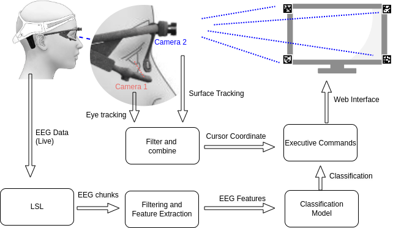
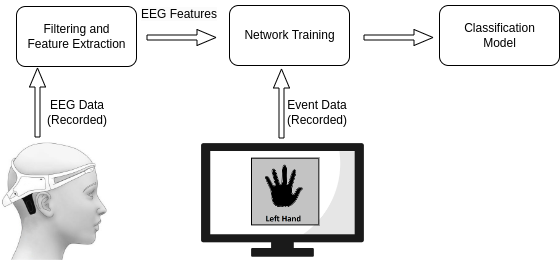
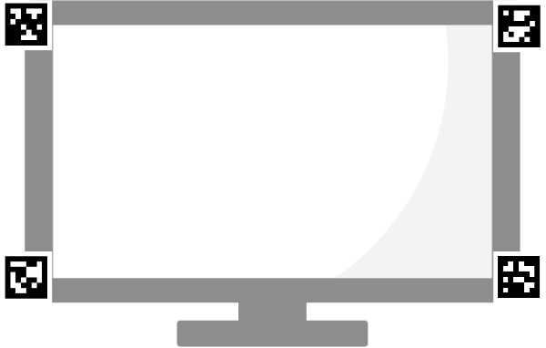

# Hybrid BCI using Wireless EEG and Eye Tracking for Web Access

**Authors**: Bhavesh K Verma, Ravichander Janapati, Rakesh Sengupta

## Overview
This research focuses on the development of a hybrid Brain-Computer Interface (BCI) that utilizes both EEG (Electroencephalogram) and Eye Tracking for enhanced web access. The proposed approach offers an affordable and user-friendly alternative to traditional BCI systems, which are often complex and require specialized equipment.

### Motor Imagery Experiment Paradigm
To train our BCI system, we collected EEG data corresponding to motor imagery activities. We have designed an experiment which enables us to sequentially record the EEG data along with the corresponding event files. While recording EEG signals, subjects are shown some images on a computer screen sequentially at an interval of 5 seconds. The images to display on the screen are chosen randomly from a set of four images with the texts: “right hand”, “left Hand”, “right leg” and “left leg” with their corresponding symbols.(Figure 1.). The subjects are asked to imagine their corresponding hands and legs moving while the visual cues get deployed on the screen. The recording of the EEG signal takes 25 minutes, in which a total of 300 visual cues are displayed, with 75 trials for each category. We have used the Matlab toolbox; Psychtoolbox to display and record the event data.

  

### EEG Data Collection
For the acquisition of EEG signals from the brain, we used Emotiv Insight – a wireless EEG headset from the brand Emotiv. The device connects wirelessly to personal computers via Bluetooth v5.0  where a dedicated software EmotivPro enables real time monitoring of EEG signal quality along with visual display of EEG signal and 5 ranges of bandpower. The device measures EEG signals using 5 electrodes corresponding to AF3, AF4, T7, T8, Pz positions. The device has a sampling rate of 128 SPS (2048 Hz internal) and resolution of 16 bits 1 LSB = 0.128 micro volt (16 bit ADC) and a bandwidth of 0.5 - 45Hz.

### EEG classification model training
We use both the EEG and Event recordings to train a classification model. The event file is stored as a CSV file by the Matlab program while the visual cues get displayed on the screen. It contains numbers coding for four limbs and the corresponding time of their display. The EEG recording is saved as an EDF file by default by EmotivePro. After correcting the recording time for the EEG data and the first event in the event file, we get the synchronized EEG and event data. All events have a separation of 5 seconds. For each event, we take the EEG data ranging from 1 second before the event to 3 seconds after the event. This gives us a set of EEG time series, each with length 4 seconds and a label for one of the four limbs from the event file. For each volunteer, we have 75 such data points. similar to other labelled sets of data, this EEG dataset can also be used to train a machine learning model for classification. Before feeding the data to a machine learning algorithm, we can use various known methods of feature extraction to the time series data. To compare the time and accuracy tradeoff in different learning algorithms we have used three different ways to classify. This data can be used in this raw form for the classification of the EEG signal using a compatible machine learning algorithm. In this version we have used EEGnet for classifying the data.

  

## Eye and Surface tracking 

### Eye Tracking
We used Pupil Core eye tracking headwear by Pupil Labs for the purpose of tracking eye movements. The device is targeted towards cutting edge eye tracking related research, moreover its lightweight and user friendly design makes it a good choice for use by the general public. The device has a gaze accuracy of 0.60 degree with a precision of 0.02. The device consists of three cameras, where two of those(eye-cameras) track motion of the pupils using  (3D gaze rays + 3D gaze point through binocular vergence), and the third camera(world-camera) is focused outwards to capture location of the screen. The eye-cameras have a sampling frequency of 200Hz @ 192x192px, while the world-camera has variable frequencies; 30Hz@1080p 60Hz@720p 120Hz@480p. The device has an internal latency of 8.5ms. It comes with an user-friendly graphical interface which has many inbuilt features related to calibration, recording, and real time streaming of the eye tracking data. 

### Surface Tracking
tracking of eye movement requires a high level of precision and calibration. In a usual experiment involving eye tracking the process of calibration takes a good amount of time and effort. Even a small amount of movement of the head in relation to the screen can give rise to inaccuracies in the measurement of eye movement. To minimize this problem we have utilized a method to track the edges of the device screen using AprilTag. AprilTags is a visual fiducial system, which utilizes black and white markers to track object locations.[\cite{olson2011apriltag}] We pasted four of such markers on the edges of our computer screen, which defines the relevant surface to a surface tracker plugin for real time tracking. Through the adjustment of the relative change on the location of the screen with respect to the eyes, the plugin adjusts the gaze parameters in realtime which produces an accurate estimation of gaze positions. Using this method reduces the need for subjects to be very steady while using the device, which makes it more practical.

### Cursor Control
Processed eye gaze data is used to control the mouse cursor on the computer screen.

  
*Flowchart or diagram illustrating the cursor control process.*

## Live access to BCI

## Contact
For more details, reach out to the principal corresponding author at [bhaveshverma32@gmail.com](mailto:bhaveshverma32@gmail.com).

